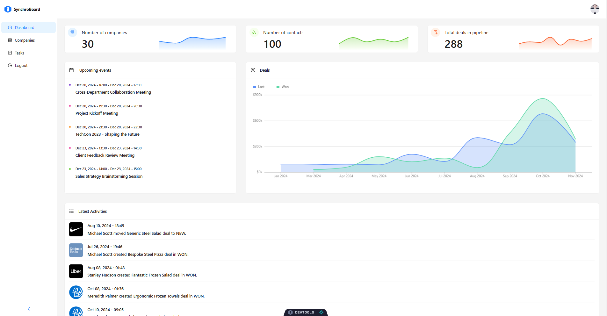
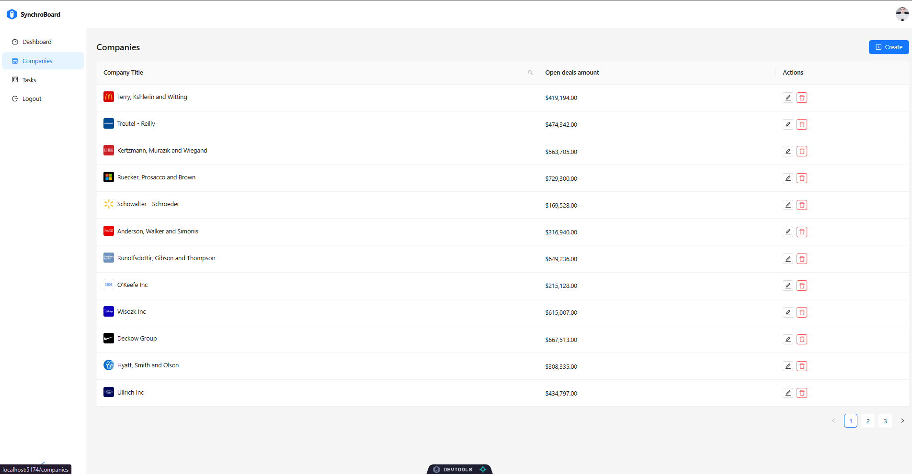
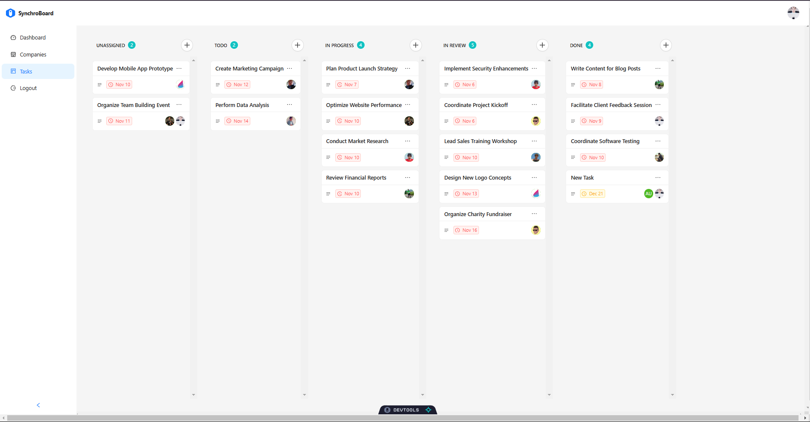
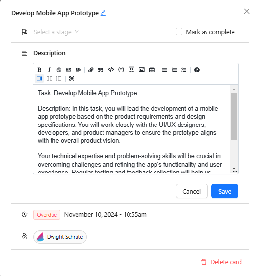

# SynchroBoard

Welcome to **SynchroBoard**, a powerful collaborative tool designed to streamline the way teams manage and synchronize their tasks and activities in real-time.

## Project Overview

**SynchroBoard** is built to provide an intuitive interface for real-time task management and collaboration. With features such as synchronized boards, real-time updates, and a fully responsive layout, it enhances the productivity of teams and organizations.

### Key Features:

- **Real-time synchronization**: Changes on the board are reflected instantly for all users.
- **Task management**: Create, edit, and manage tasks with ease.
- **User-friendly interface**: Clean, simple design that allows for easy navigation.

## Screenshots

Here are some images of the **SynchroBoard** website:

<div align="center">
    
    
    
    
</div>

## Getting Started

To set up **SynchroBoard** on your local machine, follow these steps:

### 1. Clone the repository

```bash
git clone https://github.com/<your-username>/synchroboard.git
cd synchroboard
```

### 2. Install dependencies

```bash
npm install
```

### 3. Run the development server

```bash
npm run dev
```

This will start the development server. You can access the app by opening your browser and going to http://localhost:3000.

## Available Scripts

### Running the development server.

```bash
    npm run dev
```

### Building for production.

```bash
    npm run build
```

### Running the production server.

```bash
    npm run start
```
